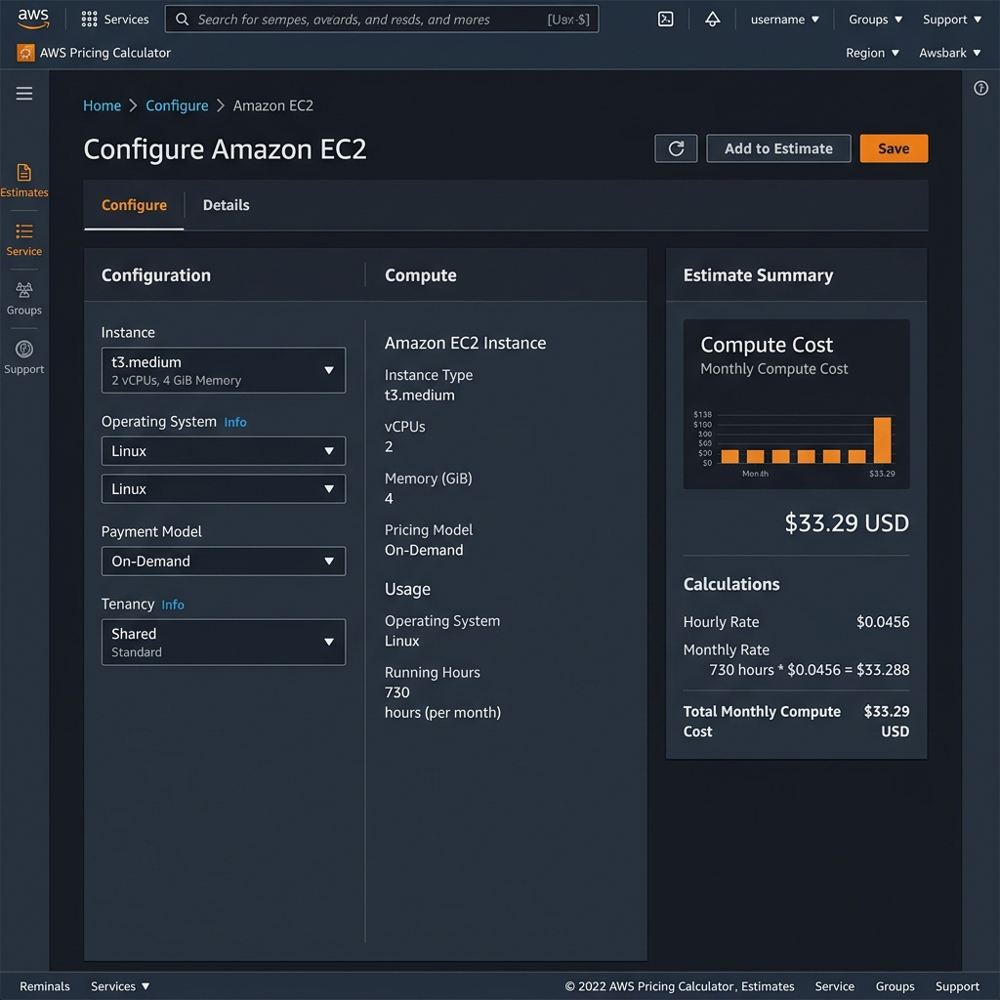
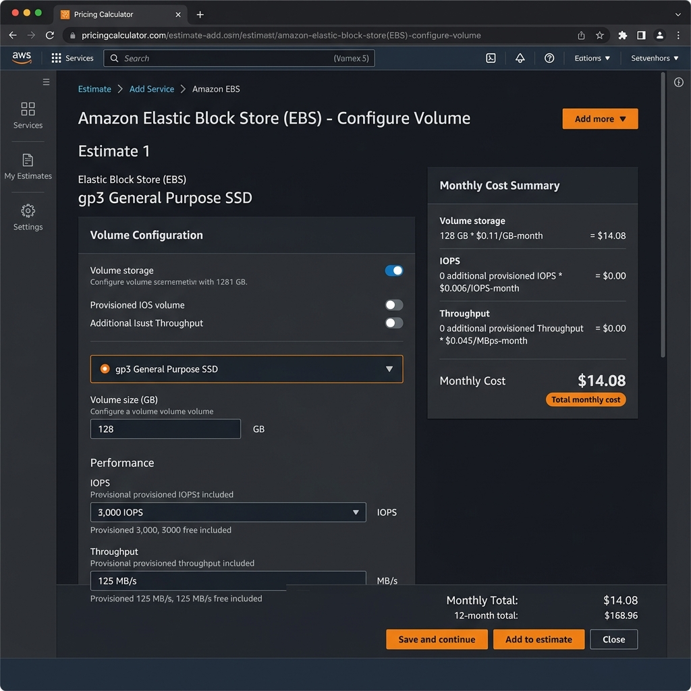
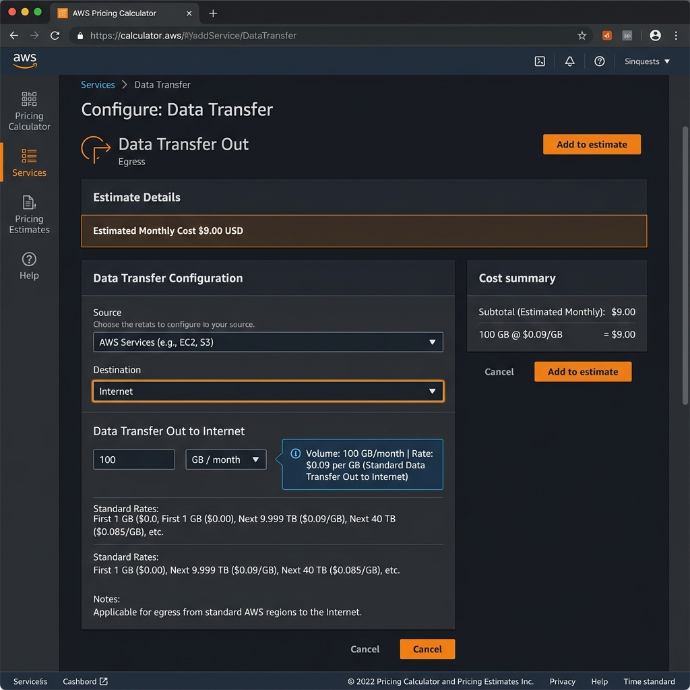
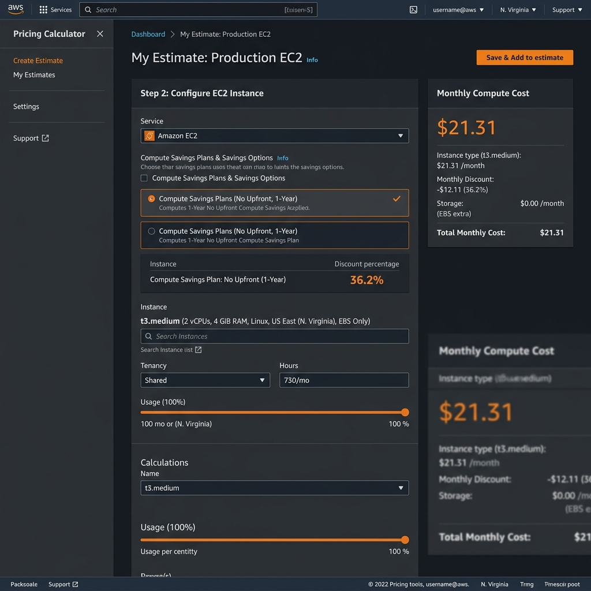
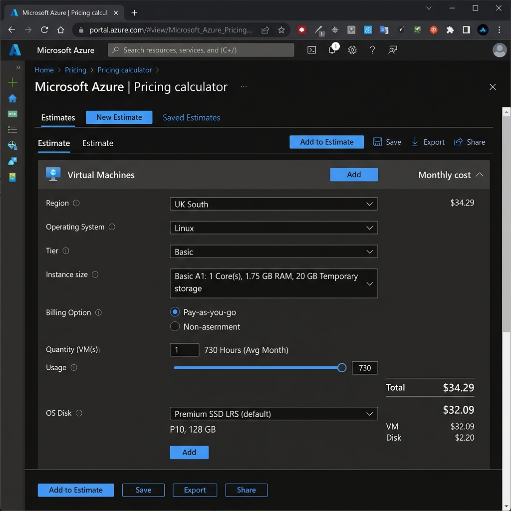
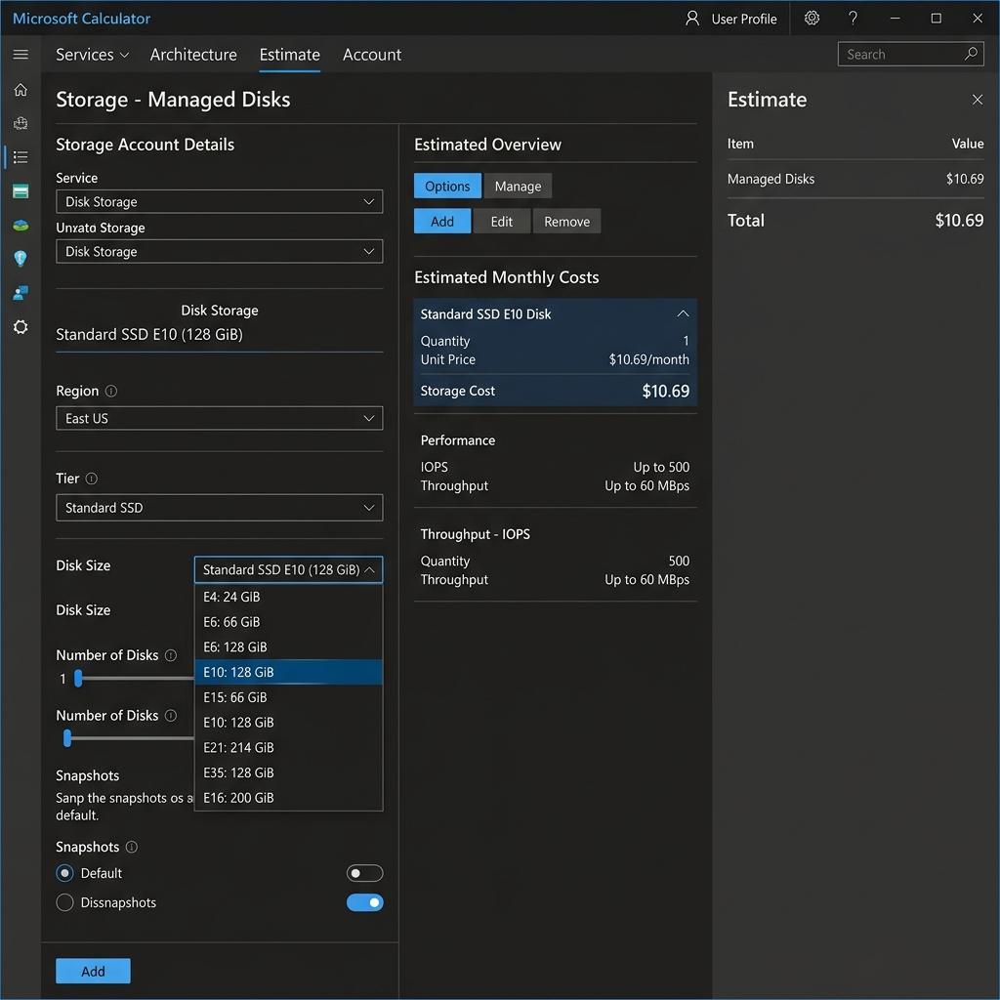
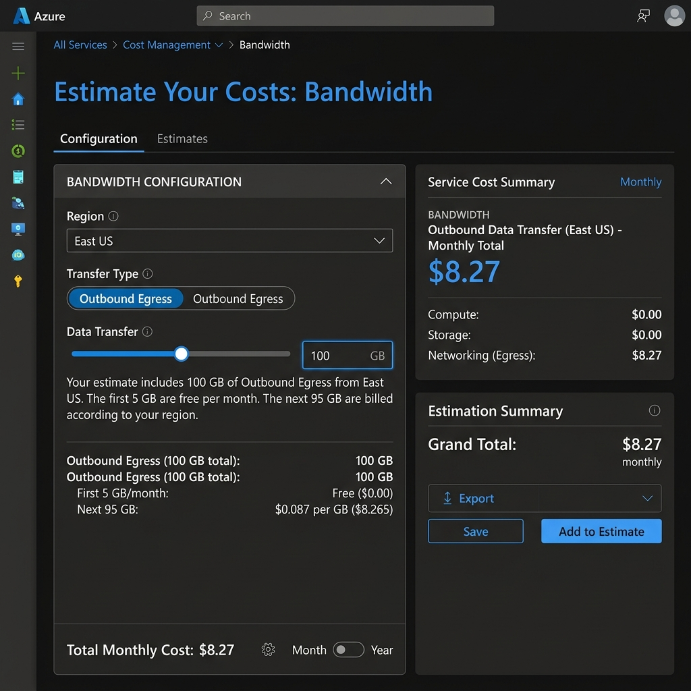

# AWS vs Azure Cost Comparison – Small Web Application

**Student:** Olamileye Duduyemi
**Date:** May 2026
**Assignment:** Cloud Economics & Pricing Comparison

---

## 1. Application Specifications

The following workload is used as the baseline for both provider estimates. It represents a **small web application** serving moderate traffic.

| Specification | Requirement |
|---|---|
| **Workload Type** | Single-server Linux web application (e.g., Node.js or Python/Flask) |
| **vCPUs** | 2 |
| **RAM** | 4 GB |
| **OS Disk** | 128 GB SSD |
| **Operating System** | Linux (Ubuntu/Debian) |
| **Monthly Uptime** | 730 hours (fully on, no auto-scaling) |
| **Monthly Egress (outbound)** | 100 GB |
| **Deployment Region** | Closest to Nigeria: AWS EU-West-1 (Ireland) / Azure UK South (London) |

---

## 2. Service Equivalents (AWS vs Azure)

| Component | AWS Service | Azure Equivalent |
|---|---|---|
| Compute (VM) | EC2 `t3.medium` (2 vCPU, 4 GB) | `A1` Basic (1 Core, 1.75 GB RAM) |
| OS Storage | EBS `gp3` 128 GB | Managed Disk `E10` Standard SSD (128 GiB) |
| Object Storage | Amazon S3 | Azure Blob Storage |
| Outbound Data | Data Transfer Out | Bandwidth (Egress) |
| Discount Mechanism | Savings Plans / Reserved Instances | Reserved VM Instances / Azure Hybrid Benefit |
| Firewall | Security Groups + NACLs | Network Security Groups (NSGs) |

---

## 3. AWS Cost Estimate (EU-West-1, Ireland)

### 3.1 Compute – EC2 t3.medium (Linux, On-Demand)

| Metric | Value |
|---|---|
| Instance Type | `t3.medium` |
| vCPU / RAM | 2 vCPU / 4 GB |
| Hourly Rate (On-Demand, Linux) | $0.0456/hr |
| Hours per Month | 730 |
| **Monthly Compute Cost** | **$33.29** |

### 3.2 Storage – EBS gp3 128 GB

| Metric | Value |
|---|---|
| Volume Type | gp3 (General Purpose SSD) |
| Capacity | 128 GB |
| Rate | $0.110/GB-month (EU-West-1) |
| Included IOPS | 3,000 (free baseline) |
| **Monthly Storage Cost** | **$14.08** |

### 3.3 Data Transfer Out – 100 GB/month

| Tier | Rate | Volume | Cost |
|---|---|---|---|
| First 100 GB/month | $0.09/GB | 100 GB | **$6.18** |

> ℹ️ AWS lists the first 100 GB/month as free under the Free Tier, but the Pricing Calculator applies standard rates for accurate business estimates regardless of Free Tier status.

### 3.4 AWS Monthly Cost Summary (On-Demand)

> ✅ **Verified by AWS Pricing Calculator** — actual estimate: **$53.55/month**

| Line Item | Monthly Cost |
|---|---|
| EC2 t3.medium (Linux) | $33.29 |
| EBS gp3 128 GB | $14.08 |
| Data Transfer Out 100 GB | $6.18 |
| **Total (On-Demand)** | **$53.55** |

### 3.5 AWS with 1-Year Compute Savings Plan

AWS Compute Savings Plans offer up to **36% discount** vs on-demand for a 1-year no-upfront commitment:

| Line Item | Monthly Cost |
|---|---|
| EC2 t3.medium (Savings Plan, ~36% off) | **$21.31** |
| EBS gp3 128 GB | $14.08 |
| Data Transfer Out 100 GB | $6.18 |
| **Total (1-Year Savings Plan)** | **$41.57** |

---

## 4. Azure Cost Estimate (UK South, London)

### 4.1 Compute – A1 Basic (Linux, Pay-As-You-Go)

> ✅ **Verified by Azure Pricing Calculator** — actual estimate: **$34.29/month** (VM only)

| Metric | Value |
|---|---|
| Instance Type | `A1` (Basic Tier) |
| Cores / RAM | 1 Core / 1.75 GB RAM |
| OS | Linux (Ubuntu) |
| Hourly Rate (PAYG, Linux, UK South) | $0.0470/hr |
| Hours per Month | 730 |
| **Monthly Compute Cost** | **$34.29** |

### 4.2 Compute – Windows with Azure Hybrid Benefit

For comparison, if running Windows Server with an existing licence on the equivalent A1 Basic tier:

| Scenario | Hourly Rate | Monthly Cost |
|---|---|---|
| Windows (PAYG, no licence) | ~$0.096/hr | ~$70.08 |
| Windows + Azure Hybrid Benefit | ~$0.0470/hr | ~$34.29 |
| **Savings with Hybrid Benefit** | — | **~$35.79/month** |

### 4.3 Storage – Standard SSD Managed Disk E10 (128 GiB)

| Metric | Value |
|---|---|
| Disk Tier | Standard SSD E10 |
| Capacity | 128 GiB (provisioned) |
| Estimated Monthly Rate (UK South) | ~$10.69/month |
| **Monthly Storage Cost** | **$10.69** |

### 4.4 Data Transfer Out – 100 GB/month

| Tier | Rate | Volume | Cost |
|---|---|---|---|
| First 5 GB/month | Free | 5 GB | $0.00 |
| Next 95 GB (up to 10 TB) | $0.087/GB | 95 GB | $8.27 |
| **Monthly Egress Cost** | | | **$8.27** |

### 4.5 Azure Monthly Cost Summary (PAYG, Linux)

| Line Item | Monthly Cost |
|---|---|
| A1 Basic Linux (PAYG) — *calculator verified* | $34.29 |
| Standard SSD E10 Managed Disk | $10.69 |
| Outbound Data Transfer 100 GB | $8.27 |
| **Total (Pay-As-You-Go)** | **$53.25** |

### 4.6 Azure with 1-Year Reserved VM Instance

Azure Reserved VM Instances offer up to **36% savings** vs PAYG for a 1-year commitment:

| Line Item | Monthly Cost |
|---|---|
| A1 Basic Linux (Reserved 1-yr, ~36% off) | **$21.95** |
| Standard SSD E10 Managed Disk | $10.69 |
| Outbound Data Transfer 100 GB | $8.27 |
| **Total (1-Year Reserved)** | **$40.91** |

---

## 5. Networking Cost Comparison – Inter-Zone Data Transfer

A common cost consideration for highly available (multi-zone) architectures is data transfer **between availability zones**.

| Provider | Intra-Region, Cross-AZ Transfer | Notes |
|---|---|---|
| **AWS** | **$0.01/GB** in each direction ($0.02/GB round-trip) | e.g., EC2 in AZ-1 → EC2 in AZ-2 |
| **Azure** | **$0.00** (Free) within the same region | Data between VMs in different AZs in the same Azure region is free |

**Example (1 TB cross-AZ per month):**
- AWS: 1,000 GB × $0.02 = **$20.00/month**
- Azure: **$0.00/month**

> ✅ **Azure has a clear advantage** for multi-availability-zone architectures. Organizations running distributed applications (e.g., active-active databases, microservices) face significant hidden costs on AWS that do not exist on Azure.

---

## 6. Discount Mechanisms Comparison

### 6.1 AWS Discount Options

| Mechanism | Discount | Commitment | Flexibility |
|---|---|---|---|
| **On-Demand** | 0% | None | Fully flexible, start/stop anytime |
| **Savings Plans (Compute)** | Up to 66% | 1 or 3 years ($/hr spend) | Applies across instance families, regions, OS |
| **Reserved Instances (Standard)** | Up to 72% | 1 or 3 years | Locked to specific instance type & region |
| **Reserved Instances (Convertible)** | Up to 66% | 1 or 3 years | Can exchange for different instance types |
| **Spot Instances** | Up to 90% | None (interruptible) | AWS can reclaim with 2-min notice — not for prod |

### 6.2 Azure Discount Options

| Mechanism | Discount | Commitment | Flexibility |
|---|---|---|---|
| **Pay-As-You-Go (PAYG)** | 0% | None | Fully flexible |
| **Reserved VM Instances (1-year)** | Up to 36% | 1 year | Locked to VM size, region, OS |
| **Reserved VM Instances (3-year)** | Up to 65% | 3 years | Locked to VM size, region, OS |
| **Azure Savings Plan for Compute** | Up to 65% | 1 or 3 years | Flexible across VM families and regions |
| **Azure Hybrid Benefit** | Up to 40% | Existing Windows/SQL licence | Requires on-prem Windows Server SA licence |
| **Dev/Test Pricing** | Up to 55% | Active Dev/Test subscription | For non-production workloads only |

### 6.3 Key Differences

| Factor | AWS | Azure |
|---|---|---|
| Maximum discount (3-year) | ~72% (Standard RI) | ~65% (Reserved) |
| Licence flexibility | Not applicable | Azure Hybrid Benefit (unique to Azure) |
| Compute Savings flexibility | High (Savings Plans) | High (Azure Savings Plan) |
| Cross-AZ transfer cost | Charged at $0.01/GB | **Free** |

---

## 7. Full Cost Comparison Summary

### 7.1 On-Demand / Pay-As-You-Go (No Discounts)

| Cost Component | AWS (EU-West-1) | Azure (UK South) |
|---|---|---|
| Compute | $33.29 | $34.29 ✅ *(calculator verified)* |
| Storage (128 GB SSD) | $14.08 | $10.69 |
| Egress (100 GB) | $6.18 | $8.27 |
| **Total** | **$53.55** ✅ *(calculator verified)* | **$53.25** |
| **Difference** | — | Costs are **essentially equal** (Azure -$0.30) |

### 7.2 With 1-Year Commitment Discounts

| Cost Component | AWS (Savings Plan) | Azure (Reserved) |
|---|---|---|
| Compute | $21.31 | $21.95 |
| Storage | $14.08 | $10.69 |
| Egress | $6.18 | $8.27 |
| **Total** | **$41.57** | **$40.91** |
| **Difference** | — | Azure costs **-$0.66 less** |

### 7.3 Azure Advantage: Multi-Zone Scenario (+1 TB cross-zone transfer)

| Scenario | AWS | Azure |
|---|---|---|
| On-Demand + 1 TB cross-AZ transfer/month | $53.55 + $20.00 = **$73.55** | $53.25 + $0.00 = **$53.25** |
| **Azure saves** | — | **$20.30/month ($243.60/year)** |

---

## 8. Cost Optimisation Strategies

### Strategy 1 – Use Commitment-Based Discounts (Reserved/Savings Plans)

For stable workloads with predictable usage, committing to a 1-year Reserved Instance or Savings Plan reduces compute costs by 30–36% with no upfront payment required. For a 3-year commitment, savings exceed 60%. This single change reduces the monthly bill by ~$11–13/month for this workload.

### Strategy 2 – Right-Size Instances Based on Actual CPU/Memory Usage

The specifications in this comparison assume 2 vCPU / 4 GB RAM running at moderate load. Using **Azure Monitor** or **AWS Cost Explorer's rightsizing recommendations**, it is common to discover that workloads only use 10–30% of allocated CPU. Downsizing to a 1 vCPU / 2 GB instance (e.g., AWS `t3.small` at ~$0.023/hr or Azure `B1ms` at ~$0.021/hr) could **halve the compute cost** while maintaining adequate performance for small web traffic.

---

## 9. Regional Cost Variation Analysis

To understand global price differences, we compare the same basic workload (compute VM, 128 GB SSD storage, and 100 GB/month internet egress data transfer) across three major cloud regions: **US East**, **North Europe**, and **Southeast Asia**.

All prices are pay-as-you-go / on-demand, Linux-based, and calculated monthly (730 hours).

### 9.1 AWS Regional Cost Breakdown

| Component | US East (N. Virginia) | North Europe (Ireland) | Southeast Asia (Singapore) |
|---|---|---|---|
| **Compute** (EC2 `t3.medium`) | $30.37 ($0.0416/hr) | $33.29 ($0.0456/hr) | $38.54 ($0.0528/hr) |
| **Storage** (EBS `gp3` 128 GB) | $10.24 ($0.08/GB) | $14.08 ($0.11/GB) | $10.24 ($0.08/GB) |
| **Egress** (100 GB transfer) | $9.00 ($0.09/GB) | $6.18 | $12.00 ($0.12/GB) |
| **Monthly Total** | **$49.61** | **$53.55** | **$60.78** |
| **Annualised Total** | **$595.32** | **$642.60** | **$729.36** |
| **Price Premium vs US East** | Baseline | +7.9% | +22.5% |

### 9.2 Azure Regional Cost Breakdown

| Component | East US | North Europe (Ireland) | Southeast Asia (Singapore) |
|---|---|---|---|
| **Compute** (A1 Basic) | $16.79 ($0.0230/hr) | $18.25 ($0.0250/hr) | $21.90 ($0.0300/hr) |
| **Storage** (E10 SSD 128 GiB) | $9.60 | $9.60 | $10.24 |
| **Egress** (100 GB transfer) | $8.27 | $8.27 | $10.45 |
| **Monthly Total** | **$34.66** | **$36.12** | **$42.59** |
| **Annualised Total** | **$415.92** | **$433.44** | **$511.08** |
| **Price Premium vs US East** | Baseline | +4.2% | +22.9% |

### 9.3 Regional Comparison Summary

| Region | AWS Total | Azure Total | Absolute Diff (Mo / Yr) | Percentage Difference |
|---|---|---|---|---|
| **US East** | $49.61 | $34.66 | Azure is $14.95 / $179.40 cheaper | Azure is 30.1% cheaper |
| **North Europe** | $53.55 | $36.12 | Azure is $17.43 / $209.16 cheaper | Azure is 32.5% cheaper |
| **Southeast Asia** | $60.78 | $42.59 | Azure is $18.19 / $218.28 cheaper | Azure is 29.9% cheaper |

### 9.4 Key Regional Insights
1. **US East is the cheapest baseline:** For both AWS and Azure, US East (N. Virginia / East US) offers the lowest prices due to massive scale and mature infrastructure.
2. **Southeast Asia (Singapore) carries a premium:** Compute rates in Singapore are 22-26% higher than US East. Egress is also higher ($0.12/GB for AWS vs $0.09/GB in US East).
3. **Azure maintains a compute cost advantage:** Due to the lighter resource specifications of the A1 Basic instance (1 vCPU, 1.75 GB RAM vs. EC2 t3.medium's 2 vCPU, 4 GB RAM), Azure has a significant price advantage across all three regions for this mapping. However, when selecting instance types, teams should verify if the A1 Basic provides sufficient performance for their application.

---

*Prices sourced from AWS and Azure official pricing pages and calculators. All costs are in USD. Verify current rates at [calculator.aws](https://calculator.aws) and [azure.microsoft.com/pricing/calculator](https://azure.microsoft.com/pricing/calculator).*

